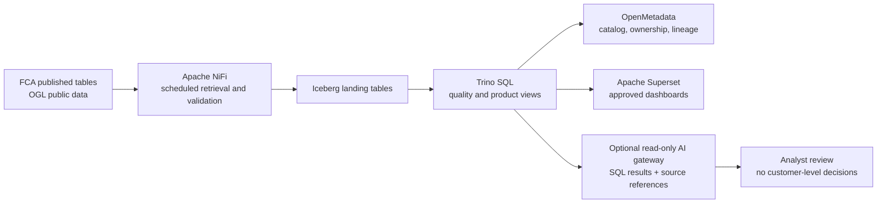

# Reference architecture

## Design objective

Create a governed analytics path for actual FCA-published complaints tables. The fabric pattern connects acquisition, table storage, SQL, metadata and consumer access. The chosen tools are separate open-source projects; this repository does not claim a ready-made integrated data-fabric product.

## Data products

### FCA Product Complaints

Product-level complaints volumes, product group, half-year reporting periods. The bundled view contains values published for 2024 H1, 2024 H2, 2025 H1 and 2025 H2.

### FCA Contextualised Product Complaints

Product-level complaints per 1,000 relevant policies, balances, accounts or agreements, as shown in FCA tables. Denominators differ by product; this is not a directly comparable common rate across all categories. Blank source values stay null.

### FCA Market Complaint Outcomes

Market-level complaints closed, closure timing bands, upheld counts/rate and redress measures for the same four periods.

## Component responsibilities

| Component | Responsibility | Boundary |
|---|---|---|
| Apache NiFi | Schedule retrieval, validate file/table structure, capture checksums and run metadata, route failures for review | Provenance is not automatically business lineage; do not silently replace revised source snapshots |
| Apache Iceberg | Store versioned analytical tables on object storage | Hosting, catalog, retention, encryption, permissions and recovery remain deployment decisions |
| Trino | SQL transformations, quality checks and governed product views | Connector, catalogue and access-control configuration must be proven |
| OpenMetadata | Search, descriptions, owners, glossary, quality and lineage metadata | Connector capabilities vary; verify critical lineage edges |
| Apache Superset | User-facing product/period analytics | Define access controls and verify displayed measures against SQL |
| Optional AI gateway | Translate approved questions into constrained read-only queries and explain results with dataset/time/source citations | No raw prompt-only numerical answers; block unapproved tables and enforce permissions outside the model |

## AI boundary

The supported exploration use case is an **analyst assistant for aggregate complaints data**: answer bounded questions against curated tables, show the reporting period and source reference, and summarize significant changes for a human to investigate. Use deterministic SQL for numerical facts; the language model may explain the query and result but cannot invent values or infer root causes unsupported by these tables.

The data has firm/product aggregates and half-yearly cadence. It has no complaint narratives, customer/account records, transaction events or current operational queue. It cannot support individual customer profiling, customer decisions, real-time alerts, root-cause claims or a dependable high-frequency forecast. For any real model, assess purpose, privacy, security, conduct, model risk, evaluation, access, logging, monitoring and human oversight with the accountable firm functions.

## Decisions to resolve for implementation

- approved source retrieval method and release snapshot policy;
- how to verify new FCA table versions and detect revisions;
- separation of acquired, normalized and curated layers;
- canonical period/product identifiers while retaining FCA labels;
- role model for public data, project operators and dashboard users;
- catalogue/lineage integration and metadata stewardship;
- service objectives, schedule, retries, alerts, backup and recovery;
- retention, cost, version pinning, licence notices and dependency review;
- AI gateway/provider, data-use terms, prompt/result logs, controls and evaluation.

## Operational flow

1. Retrieve the official release and capture source URL, retrieval date, publication/update date, file hash and licence.
2. Validate expected tables, headers, periods and source-reported totals. Send unexpected change to steward review.
3. Store the source snapshot unchanged in a restricted raw zone; create curated Iceberg tables with explicit schema and lineage to snapshot.
4. Run SQL checks: period coverage, product keys, numeric ranges, null handling, reconciliation to official totals and change comparisons.
5. Register product definitions, owner, cadence, source, licence, refresh state, quality status and verified lineage.
6. Publish reviewed aggregate views and dashboards. An AI assistant can query only these views and must return source/period references.

